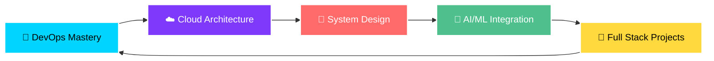

# Hey there! 👋 I'm Anupam Singh

<div align="center">
  
</div>

<div align="center">
  
  [](https://github.com/AnupamSingh2004)
  [](https://github.com/AnupamSingh2004?tab=followers)
  [](https://github.com/AnupamSingh2004?tab=repositories)
  
</div>

---

## 🚀 About Me

```typescript
const anupam = {
    role: "Full Stack Developer & DevOps Engineer",
    location: "India 🇮🇳",
    currentlyLearning: ["DevOps", "Cloud Architecture", "System Design", "Microservices"],
    openToWork: ["Full Stack Development", "DevOps Engineering", "Cloud Solutions"],
    techStack: ["React", "Node.js", "Python", "AWS", "Docker", "Kubernetes"],
    funFact: "I solve problems faster than I solve Rubik's cubes! 🧩",
    motto: "Code, Deploy, Repeat! 🔄"
};
```

<div align="center">
  
  
  
</div>

---

## 🛠️ Tech Arsenal

<div align="center">

### 💻 Languages & Frameworks


### 🎨 Frontend Technologies


### ⚙️ Backend Technologies


### ☁️ Cloud & DevOps


### 🗄️ Databases & Caching


### 📊 Monitoring & Analytics


### 🛠️ Tools & Testing


</div>

---

## 📊 GitHub Stats

<div align="center">
  
  
</div>

<div align="center">
  
</div>

---

## 🏆 GitHub Trophies

<div align="center">
  
</div>

---

## 🎯 Current Focus



<div align="center">

### 🌱 Currently Learning


</div>

---

## 🐍 Watch the Snake eat my contributions!

<div align="center">
  <picture>
    <source media="(prefers-color-scheme: dark)" srcset="https://raw.githubusercontent.com/AnupamSingh2004/AnupamSingh2004/output/github-contribution-grid-snake-dark.svg">
    <source media="(prefers-color-scheme: light)" srcset="https://raw.githubusercontent.com/AnupamSingh2004/AnupamSingh2004/output/github-contribution-grid-snake.svg">
    
  </picture>
</div>

---

## 🌐 Connect With Me

<div align="center">
  
[](https://anupamsingh2004.github.io/Anupam-Portfolio/)
[](https://linkedin.com/in/anupam-singh-78911224a)
[](https://leetcode.com/u/sanupam2004/)
[](https://instagram.com/anupam.singh19)
[](mailto:sanupam2004@gmail.com)

</div>

---

<div align="center">

### 💡 Quote of the Day


</div>

---

<div align="center">

### 💝 Thanks for visiting!


**⭐ Star my repositories if you find them interesting!**


</div>
